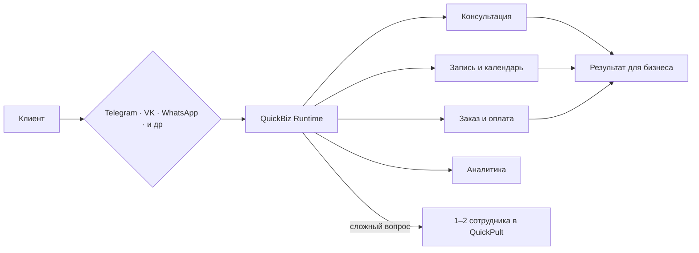

<div align="center">

# QuickBiz Automation

### Бизнес-боты, которые не просто отвечают — они ведут клиента к результату

[](https://github.com/leksmustang/QuickPult)
[](https://quickbizauto.com)
[](https://www.python.org/)
[](https://fastapi.tiangolo.com/)
[](https://www.postgresql.org/)

</div>

## О направлении

Я развиваю QuickBiz — экосистему автоматизации бизнес-процессов через управляемых ботов. Цель не в том, чтобы собрать ещё один операторский чат. Бот должен самостоятельно консультировать, квалифицировать клиента, записывать на услугу, сопровождать оплату и передавать разговор человеку только там, где действительно требуется решение специалиста.

> **QuickBiz соединяет клиента с бизнес-процессом, а не с очередью операторов.**



## Флагманский проект

### [QuickPult](https://github.com/leksmustang/QuickPult) — платформа управления автономными бизнес-ботами

QuickPult объединяет производство, размещение и контроль индивидуальных ботов в одном продукте. Один сценарий может работать одновременно в Telegram и ВКонтакте, сохранять раздельные диалоги и использовать общие бизнес-правила.

**Что уже умеет платформа:**

- производственный цикл от заявки до тестирования и передачи заказчику;
- QuickBiz Runtime для продаж, записи и индивидуальных процессов;
- Telegram webhook/polling, VK Callback API/Long Poll и слой WhatsApp Cloud API;
- единый Пульт диалогов с ручным перехватом и возвратом разговора боту;
- внутренний календарь, несколько услуг и специалистов, отмены и напоминания;
- лиды, сделки, бизнес-события, аналитика и рассылки;
- проектные уведомления сотрудников;
- тарифные ограничения и строгая изоляция данных клиентов;
- самостоятельное изменение владельцем цен, услуг, сотрудников и рабочих текстов;
- безопасное обслуживание, реконструкция и отключение переданных проектов.

```text
Заявка → Проектирование → Тест → Согласование → Подключение каналов
       → Передача клиенту → Работа 24/7 → Контроль → Обслуживание
```

**Сильная сторона:** детерминированные бизнес-действия. Цена, запись, оплата и состояние сделки не придумываются языковой моделью. Будущий AI-слой отвечает за понимание свободного текста и естественный диалог, а критичные действия остаются под контролем Runtime.

## Другие проекты

| Проект | Назначение | Сильные стороны |
|---|---|---|
| [project101](https://github.com/leksmustang/project101) | Набор Telegram-ботов для студии, психолога и детейлинга | Модульная архитектура, состояния диалога, запись, календарная логика и antiflood |
| [vk-bot](https://github.com/leksmustang/vk-bot) | Бот ВКонтакте для студии танцев | Прайс, аренда, пробная запись, оплата, отмена и перенос занятия |
| [Dance_psy_bot](https://github.com/leksmustang/Dance_psy_bot) | Отраслевые Telegram-боты | Сценарии студии и психолога, сбор данных клиента и прикладные ветки |
| [dance-psy_bot](https://github.com/leksmustang/dance-psy_bot) | Публичная версия отраслевых ботов | Развёртывание, health endpoint и устойчивый запуск нескольких процессов |
| [Ai_tg_bot](https://github.com/leksmustang/Ai_tg_bot) | Мультимодальный AI-ассистент | Текст, документы, ссылки, изображения, голос, vision и математический модуль |

## Принципы разработки

- **Индивидуальная логика вместо одинаковых воронок.** Шаблоны ускоряют старт, но бизнес-процесс проектируется под конкретную компанию.
- **Один сотрудник контролирует множество автоматизированных диалогов.** Человек подключается по исключению, а не ведёт каждую переписку вручную.
- **Сначала надёжное действие, затем красивый ответ.** Записи, сделки и оплата фиксируются проверяемыми событиями.
- **Каналы — это транспорт.** Telegram, VK, WhatsApp и будущий виджет сайта используют единое ядро проекта.
- **Владелец управляет изменяемыми данными.** Цены, услуги, специалисты, реквизиты и рабочие тексты не требуют обращения к программисту.

## Технологический фокус

`Python` · `FastAPI` · `SQLAlchemy` · `PostgreSQL` · `Telegram Bot API` · `VK API` · `WhatsApp Cloud API` · `Docker` · `Render` · `Webhook` · `Long Poll` · `REST API`

## Сейчас в работе

- безопасное сопровождение работающих проектов;
- платёжный слой с подтверждением через webhook провайдера;
- гибридный AI для свободного текста без передачи ему критичных бизнес-решений;
- внешние календари и CRM-интеграции;
- подготовка QuickPult к production-инфраструктуре.

---

<div align="center">

**Главная разработка:** [QuickPult](https://github.com/leksmustang/QuickPult) · **Продукт:** [quickbizauto.com](https://quickbizauto.com)

</div>
